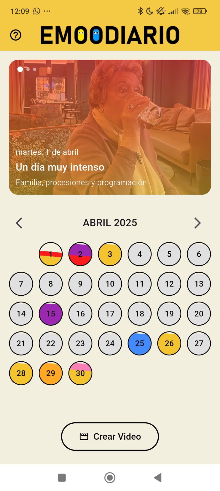
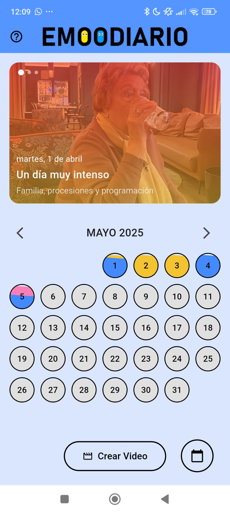

# eMOODiario😡📅😁

La mejor app para saber lo que sientes.

## Pantallas

Esta aplicación cuenta únicamente con 4 pantallas principales, pero cada una de ellas encapsula una gran cantidad de lógica, interacción y componentes visuales que hacen que la experiencia del usuario sea rica, fluida y altamente personalizada.

### Calendar_screen📅

La pantalla principal de la app, donde se refleja visualmente tu estado emocional diario. Destaca la pantalla en la que veremos un preview del día seleccionado con su título, frase del día, archivos multimedia y filtro de color según emociones destacadas. Si el día mostrado en el preview pertenece a un mes distinto al que se muestra actualmente en el calendario, aparecerá un pequeño botón abajo a la derecha que si es pulsado devuelve al usuario al mes en el que se ubica el día del preview. Cada día del calendario se pinta con uno o dos colores representando las emociones predominantes, en caso de haber más de 2 emociones se calculan las 2 predominantes. El calendario es interactivo, y al seleccionar un día podrás ver su resumen emocional con imágenes, videos, frases y título. El mes tomará el color de fondo de la emoción que más lo represente.

En la parte inferior, también se ofrece la opción de **crear un video** resumen del mes, con un solo clic.

Arriba a la izquierda se puede acceder a un **menú de ayuda** para empezar a guiarte en la app.

  
  

<em>Captura de dos meses distintos de calendar_screen</em>

También está la opción de ver nuestras fotos en grande y sin el filtro dandole un toque en el preview, ese sería nuestro acceso a la **Fullscreen_image_page**.

Si, sin embargo, lo que hacemos es dar un doble toque al preview accederemos a una pantalla distinta, la **Edit_day_screen**

### Edit_day_screen✍🏻

Esta es la pantalla donde el usuario plasma cómo se sintió un día específico. Se puede escribir un título, una frase del día, y añadir hasta 3 archivos multimedia (imágenes o videos).

Cada archivo puede asociarse con una o dos emociones gracias a una paleta de colores emocional. El usuario puede incluso ajustar con un slider personalizado el porcentaje de una emoción respecto a la otra, generando un equilibrio visual que será usado en el calendario y como filtro en los videos.

#### 🎨 Paleta de emociones y colores

La paleta de colores y las emociones asociadas son:

<ul>
  <li>🟡 <strong>Alegría</strong> – Amarillo dorado</li>
  <li>🔴 <strong>Ira</strong> – Rojo fuerte</li>
  <li>🔵 <strong>Tristeza</strong> – Azul vivo</li>
  <li>💗 <strong>Enamoramiento</strong> – Rosa intenso</li>
  <li>🟠 <strong>Ansiedad</strong> – Naranja mandarina</li>
  <li>🟣 <strong>Miedo</strong> – Morado fuerte</li>
</ul>

📸 Sugerencias de capturas:

Vista de un día editado con imágenes y selección de colores.

Slider de emociones activo entre dos colores.

Pantalla con galería de multimedia y botones de agregar.

   
 
<em>Captura de pantalla de edición emocional de un día</em>

### Video_screen📹
Una de las funcionalidades estrella de la app. Desde esta pantalla se puede crear un video recuerdo personalizado. El usuario puede:

Elegir si quiere usar todo el mes o días concretos (con calendario visual).

Filtrar por emociones (solo mostrar días con tristeza, alegría, etc).

Seleccionar duración del video.

Elegir música de fondo.

Activar el orden aleatorio de clips.

Incluir solo imágenes, solo videos o ambos.

Todo esto con una interfaz amigable y dinámica. Durante la generación, frases motivacionales se muestran para acompañar el proceso.

📸 Sugerencias de capturas:

Vista del selector de opciones (duración, emociones, tipo de media).

Calendario emergente para selección de días.

Pantalla de carga con frases tipo “Exportando momentos mágicos ✨”.

   
 
<em>Captura de pantalla de la generación de video emocional</em>

### Fullscreen_image_page📱

Cuando el usuario quiere ver a detalle sus recuerdos visuales de un día, esta pantalla muestra las imágenes o videos en pantalla completa, con una interfaz minimalista. También permite:

Reproducir videos directamente.

Descargar las imágenes al teléfono.

Ocultar la interfaz para mayor inmersión.

Ver título y frase emocional del día.

📸 Sugerencias de capturas:

Imagen en pantalla completa con título/frase superpuestos.

Vista previa de un video con botón de reproducir.

Menú inferior con opciones de compartir/descargar.

   
 
<em>Vista a detalle de recuerdos emocionales en pantalla completa</em>

